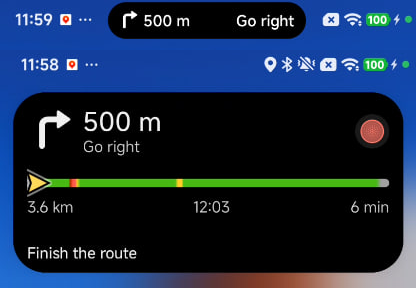

# OriginIsland — sending content to vivo's island, without root

The **Island** tab does two things: it **casts the notifications of apps you
pick** onto the island (a music player's title and progress bar, a navigation
app's next manoeuvre), and it doubles as a manual playground for vivo's
OriginIsland — the pill that grows around the front camera cutout on OriginOS
6. None of it is documented by vivo, so this page documents what the app
actually sends, where that knowledge comes from, and what to expect on your
phone.

## Setup

Nothing to install beyond the app itself. OriginIsland is notification-borne:

1. Open **Island** in the app.
2. On Android 13+, accept the **notifications** permission when asked (the
   island *is* a notification under the hood).
3. **To cast other apps**: flip the switch, tap **Grant notification access**
   (the system's notification-listener screen), then tap the apps you want —
   a music player, a navigation app. Tap a picked app's `template ›` label to
   choose which right-side template it casts with; a live progress bar in the
   source notification (a track's position, a route leg) switches the cast to
   the progress template on its own.
4. **To cast manually**: type a payload, pick a template, hit **Show**.
5. **Unmount** removes a cast the way the framework expects — a graceful
   `operation = 2` write, then the cancel.

No Shizuku, no adb, no root. Casting reads notifications through the system's
notification-listener facility (a user grant in system settings, not an
install-time permission), and the cast itself is an ordinary notification
posted by the app.

## What gets sent

The extras below ride on a normal `Notification`. vivo's internal name for the
feature is "Super Island", hence the namespace:

| Extra | Value |
| --- | --- |
| `notification.superx.operation` | `0` to show, `2` to unmount gracefully |
| `notification.superx.showNotify` | `true` |
| `notification.superx.template` | `1` base card, `2` progress card |
| `notification.superx.scene` | `"TRAIN"` — the scene the framework matches on |
| `notification.superx.baseInfos` | title, content, optional icon and subtext |
| `notification.superx.capsule` | state, content, icon — required for template resolution |
| `notification.superx.infos` | per-template payload (progress percent and color, or describe/coreInfo/image) |
| `notification.superx.shortInfos` | the same fields, `Short` suffixes, for card expansion |
| `notification.superx.island` | `island.superx.leftTemplate` (always 1) + `island.superx.rightTemplate` (1–6) with their `leftInfo`/`rightInfo` bundles |

The six right-side templates — the values upstream recovered:

| id | Template | Right side shows |
| --- | --- | --- |
| 1 | Rhythm | animated pulse, configurable color |
| 2 | Progress | progress ring driven by `progressValue` (0–100) |
| 3 | Loading | indeterminate spinner, configurable color |
| 4 | Text + icon | text then icon |
| 5 | Icon + text | icon then text |
| 6 | Capsule | symmetric capsule on a colored background |

## What the re-caster does with a notification

The listener (`IslandCastListener`) receives every notification Android
delivers, and throws away everything except what the user picked:

- not from a picked app → dropped;
- the source notification has no text → dropped;
- **media notifications** (a music player's) are treated the way OriginOS
  treats its own: the app's launcher icon rides the island bundles, and the
  artist–title line (`bigText`) is preferred over the shade's fragment;
- the source carries a live progress pair (0 < progress < max) → cast with the
  **progress** template, percent and all, whatever template the app was given;
- otherwise → cast with the app's configured template, its title on the
  island's left side, its text on the right.

A new cast from the same app replaces the previous one, and when the source
notification is removed the cast is unmounted — the island shows what is
playing *now*, not a history.

The picker's quick filters (All / Music / Navigation) bucket apps by their
label and package — a music player calls itself a music player — and picking
a recognised media app defaults its template to text + icon, the shape OriginOS
media pills use. Overriding per app stays one tap.

## Where the knowledge comes from, and its limits

This is a faithful port of the sender in
[CunnyPlayground's `originos-experimental` branch](https://github.com/theVakhovskeIsTaken/CunnyPlayground/tree/originos-experimental)
by **theVakhovskeIsTaken**, who reverse-engineered the protocol out of the
OriginOS 6 framework — the same repository the Discover screen credits for the
Live Updates and HyperIsland casters. The banner above and the comparison
image are from that repository, unmodified, and are credited here for that
reason.

Be honest about what a port can promise:

- The renderer is **closed-source and vivo's**. The preview in the app draws
  the *shape* of the chosen template, not what the phone will actually render.
- Keys vivo does not implement on a given build are **ignored silently** —
  a payload can be perfectly formed and still change nothing.
- On non-vivo phones the notification appears as an ordinary notification and
  nothing else happens. The tab's status card tells you which case you are in
  (`VIVO` vs `GENERIC ANDROID`), read from `Build.BRAND`; the OriginOS version
  property is not readable from an ordinary app and is reported as unknown.
- Only the wire keys the upstream sender writes are documented above. Anything
  else in the framework is guesswork and deliberately left out.

## Provenance

| File | Role |
| --- | --- |
| `core/OriginIslandTemplates.kt` | the payload builder — pure, JVM-tested, ported from upstream |
| `service/OriginIslandSender.kt` | channel, icon sharing, scene registration, cancel path |
| `ui/screens/OriginIslandScreen.kt` | the playground tab and its shape preview |
| `app/src/test/.../OriginIslandTest.kt` | pins the wire format so refactors cannot drift |
